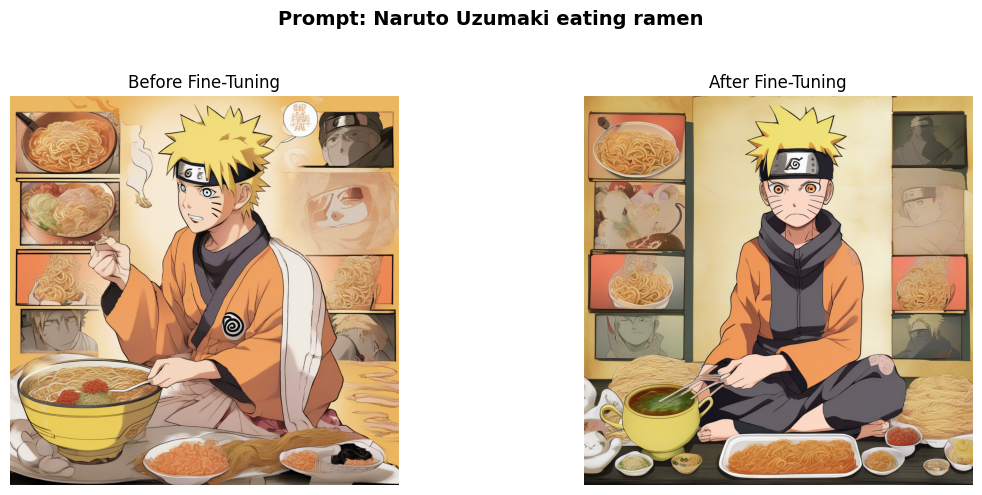
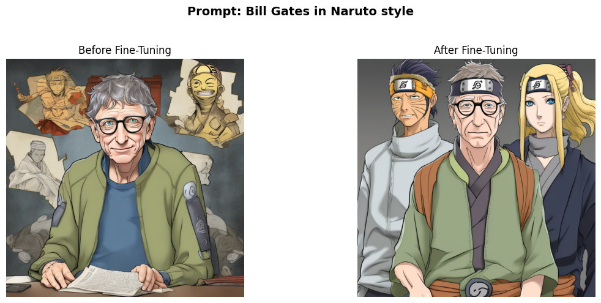
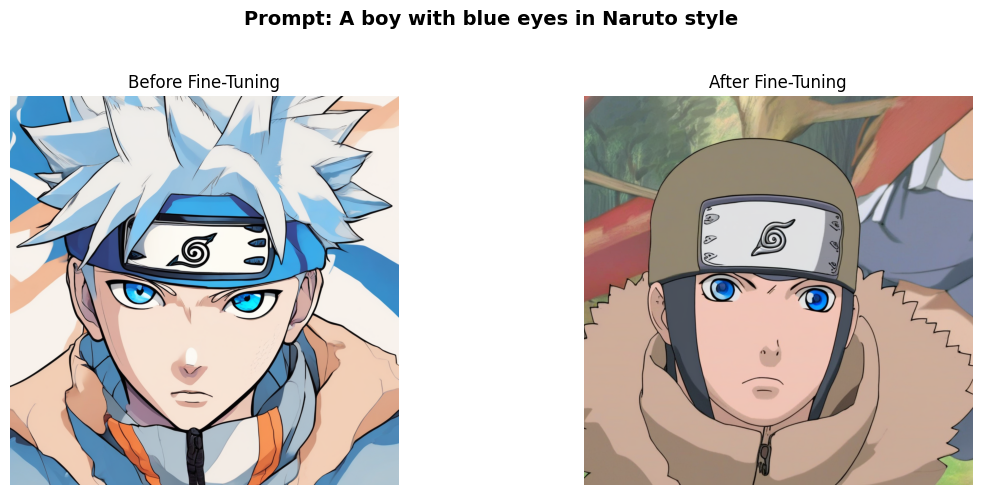

# Fine-tuning SDXL with LoRA

This repo documents how I squeezed a Naruto-style LoRA out of Stable Diffusion XL while staying inside a single 16 GB GPU. Everything you need—from data prep and training to comparison shots—is inside the notebooks and folders in this project.

---

## Project at a Glance

- **Goal**: Adapt SDXL to the Naruto universe (characters, outfits, colors, line work) without touching the full 5.2 B parameters.
- **Hardware budget**: 16 GB VRAM.
- **Approach**: Train lightweight LoRA adapters, then fuse them back into SDXL for fast inference.
- **Entry points**:
  - `sdxl_training_code.ipynb`: end-to-end training loop with logging.
  - `sdxl_inference.ipynb`: how the LoRA is loaded/fused and how the evaluation prompts are rendered.

---

## Training Recipe Highlights

- **Data**: Naruto-focused image/caption pairs covering multiple characters and scenes so the model learns a broader style instead of one subject.
- **Resolution**: 1024×1024 to match SDXL’s native training size and avoid wasting capacity.
- **Batch size**: 3. With the rest of the optimizations in place, this was the sweet spot for stable gradients.
- **What gets tuned**: U-Net LoRA ranks plus the text encoder. Training the text encoder makes it latch on to Naruto-specific vocabulary without blowing up VRAM.

---

## Memory-Friendly Tricks that Made It Possible

1. **LoRA adapters**  
   Freeze the base weights and train tiny rank-decomposition matrices inside the attention blocks. Only ~4–5 % of parameters become trainable, cutting VRAM needs roughly in half while keeping checkpoint sizes in the tens of megabytes.

2. **Mixed precision (FP16)**  
   Halves memory for activations/weights and speeds up math on tensor cores with negligible quality loss for diffusion models.

3. **8-bit Adam**  
   Optimizer states drop from 32-bit to 8-bit via quantization, giving ~4× memory savings with no noticeable training instability.

4. **Gradient checkpointing**  
   Recompute activations on the backward pass instead of storing them. Adds compute, saves memory—totally worth it here.

5. **xFormers attention**  
   Memory-efficient attention kernels keep high-resolution generations (1024²) feasible and give a modest throughput bump.

### Why Not DreamBooth?

DreamBooth shines for single subjects with 3–5 photos plus class-image regularization. Our dataset spans dozens of characters and compositions, so a style-centric LoRA is a better match and avoids the overhead of generating class images.

---

## How to Reproduce

1. **Training**  
   Open `sdxl_training_code.ipynb`, point it to your dataset on disk or in the cloud, and step through the cells. The notebook already includes logging hooks, optimizer config, and checkpoint saving to `checkpoints/`.

2. **Inference / Comparison**  
   Use `sdxl_inference.ipynb`. It:
   - Loads the base SDXL pipeline.
   - Runs three evaluation prompts without LoRA for a baseline.
   - Loads `checkpoints/pytorch_lora_weights_450.safetensors`, activates the adapter, and fuses it for fast inference.
   - Regenerates the same prompts post-training so you can compare before/after.

---

## Sample Outputs

The `images/` folder stores side-by-side grids exported from the inference notebook. Each image uses identical seeds before and after fine-tuning so differences are easy to spot.

| Prompt | Result |
| --- | --- |
| Naruto Uzumaki eating ramen |  |
| Bill Gates in Naruto style |  |
| A boy with blue eyes in Naruto style |  |

---

